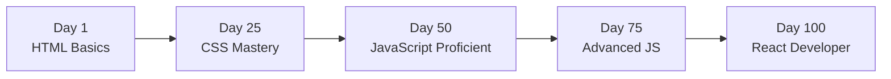

# 💻 100 Days of Code - Full-Stack Development Journey

<div align="center">


**A Systematic Full-Stack Development Learning Journey**

[🚀 Live Demo](https://100-days-of-code-eta.vercel.app) • [📂 Projects](#-featured-projects) • [🛠️ Tech Stack](#-technologies-learned)

</div>

---

## 🎯 Mission Statement

**Started**: September 6, 2024
**Commitment**: Code and learn every single day for 100 days
**Goal**: Transform from beginner to full-stack developer through consistent, project-based learning

> *"The journey of a thousand miles begins with a single step. This is my journey from HTML basics to full-stack applications."*

---

## 📊 Journey Statistics

<table>
<tr>
<td align="center"><b>📁 Total Projects</b><br/>44+</td>
<td align="center"><b>💾 Commits</b><br/>64+</td>
<td align="center"><b>📅 Days Logged</b><br/>100</td>
<td align="center"><b>⏱️ Hours Coded</b><br/>300+</td>
</tr>
<tr>
<td align="center"><b>📝 Lines of Code</b><br/>10,000+</td>
<td align="center"><b>🐛 Bugs Fixed</b><br/>50+</td>
<td align="center"><b>🎓 Skills Mastered</b><br/>15+</td>
<td align="center"><b>🚀 Deployed Apps</b><br/>10+</td>
</tr>
</table>

---

## 🌟 What I Built

### 🚀 Live Deployment
**🌐 Portfolio URL:** [https://100-days-of-code-eta.vercel.app](https://100-days-of-code-eta.vercel.app)

Showcasing my complete learning journey with all projects in one place!

---

## 🛠️ Technologies Learned

### Language Distribution

<table>
<tr>
<td width="25%" align="center">


**30.5%**

</td>
<td width="25%" align="center">


**25.9%**

</td>
<td width="25%" align="center">


**22.6%**

</td>
<td width="25%" align="center">


**19.8%**

</td>
</tr>
</table>

### Complete Tech Stack

**Frontend Fundamentals**
- HTML5 (Semantic markup, accessibility)
- CSS3 (Flexbox, Grid, animations, transforms, variables)
- JavaScript ES6+ (DOM manipulation, async/await, fetch API)

**Frontend Frameworks & Libraries**
- React.js (Hooks, components, state management)
- TypeScript (Type safety, interfaces, generics)
- Tailwind CSS (Utility-first styling)

**Backend Technologies** *(Planned/In Progress)*
- Node.js
- Express.js
- MongoDB

**Tools & Deployment**
- Git & GitHub (Version control)
- Vercel (Deployment platform)
- VS Code (IDE)
- Chrome DevTools

---

## 📚 Learning Path

### Phase 1: HTML/CSS Fundamentals (Days 1-25)

**Mastered**:
- Semantic HTML structure
- CSS Box Model
- Flexbox & Grid layouts
- Responsive design principles
- CSS animations and transforms
- CSS variables and custom properties

**Key Projects**:
- Tribute Page
- Cafe Menu
- Colored Markers
- Registration Form
- Survey Form
- Magazine Layout

---

### Phase 2: JavaScript Essentials (Days 26-50)

**Mastered**:
- Variables, data types, operators
- Functions and arrow functions
- Arrays and array methods
- Objects and object methods
- DOM manipulation
- Event handling
- Local storage
- Fetch API and promises

**Key Projects**:
- Passenger Counter App
- Blackjack Game
- Role-Playing Game
- Gradebook App
- Pyramid Generator
- Calorie Counter with form validation

---

### Phase 3: Advanced JavaScript (Days 51-75)

**Mastered**:
- Async/await patterns
- API integration
- Chrome Extension development
- Modern JavaScript features
- Error handling
- Debugging techniques

**Key Projects**:
- Leads Tracker Chrome Extension
- Weather App with API
- Todo List with localStorage
- Music Player
- Random Quote Generator
- Calculator App

---

### Phase 4: React & Modern Development (Days 76-100)

**Mastered**:
- React components and props
- React hooks (useState, useEffect)
- Component lifecycle
- Conditional rendering
- Responsive design patterns
- Deployment with Vercel

**Key Projects**:
- React Portfolio
- Task Manager App
- E-commerce Product Card
- API-driven applications
- Responsive dashboards

---

## 🏆 Featured Projects

### 1. **Chrome Extension - Leads Tracker**
**Technologies**: JavaScript, Chrome API, Local Storage
**Description**: Save and manage important links with one click
**Learning**: Browser extension development, localStorage API
**Status**: ✅ Completed

---

### 2. **Role-Playing Game**
**Technologies**: JavaScript, OOP, Game Logic
**Description**: Text-based RPG with combat system
**Learning**: Object-oriented programming, state management
**Status**: ✅ Completed

---

### 3. **Calorie Counter with Form Validation**
**Technologies**: JavaScript, Form Validation, DOM Manipulation
**Description**: Track daily calorie intake with validation
**Learning**: Advanced form handling, input validation patterns
**Status**: ✅ Completed

---

### 4. **Weather App**
**Technologies**: JavaScript, Fetch API, OpenWeather API
**Description**: Real-time weather data for any city
**Learning**: API integration, async/await, error handling
**Status**: ✅ Completed

---

### 5. **Responsive Magazine Layout**
**Technologies**: HTML, CSS Grid, Flexbox, Responsive Design
**Description**: Fully responsive magazine-style webpage
**Learning**: Advanced CSS Grid, mobile-first design
**Status**: ✅ Completed

---

### 6. **Ferris Wheel Animation**
**Technologies**: CSS Animations, Transforms
**Description**: Animated ferris wheel using pure CSS
**Learning**: CSS animations, transform properties
**Status**: ✅ Completed

---

### 7. **Penguin with CSS Transforms**
**Technologies**: CSS Transforms, Animations
**Description**: Interactive penguin using CSS only
**Learning**: Complex CSS transformations
**Status**: ✅ Completed

---

### 8. **City Skyline with CSS Variables**
**Technologies**: CSS Custom Properties, Responsive Design
**Description**: Dynamic city skyline changing with time of day
**Learning**: CSS variables, theming systems
**Status**: ✅ Completed

---

### 9. **Todo List Application**
**Technologies**: JavaScript, localStorage, CRUD Operations
**Description**: Full CRUD todo app with persistence
**Learning**: State management, localStorage, CRUD patterns
**Status**: ✅ Completed

---

### 10. **React Portfolio Website**
**Technologies**: React, TypeScript, Responsive Design
**Description**: Personal portfolio showcasing all projects
**Learning**: React fundamentals, component architecture
**Status**: ✅ Completed & Deployed

---

## 📂 Project Structure

```
100-days-of-code/
├── 01-html-css-fundamentals/
│   ├── tribute-page/
│   ├── cafe-menu/
│   ├── colored-markers/
│   └── ...
├── 02-javascript-basics/
│   ├── passenger-counter/
│   ├── blackjack-game/
│   ├── rpg-game/
│   └── ...
├── 03-advanced-javascript/
│   ├── leads-tracker-extension/
│   ├── weather-app/
│   ├── todo-list/
│   └── ...
├── 04-react-and-modern-dev/
│   ├── react-portfolio/
│   ├── task-manager/
│   └── ...
└── README.md
```

---

## 📈 Progress Timeline



### Key Milestones

- ✅ **Day 10**: First complete webpage
- ✅ **Day 20**: First CSS animation
- ✅ **Day 30**: First JavaScript program
- ✅ **Day 40**: First interactive app
- ✅ **Day 50**: First Chrome extension
- ✅ **Day 60**: First API integration
- ✅ **Day 75**: First React component
- ✅ **Day 100**: Full-stack capable developer

---

## 💡 Key Learnings

### Technical Skills

1. **Semantic HTML**: Proper structure improves accessibility and SEO
2. **CSS Mastery**: Flexbox and Grid solve 90% of layout problems
3. **JavaScript Fundamentals**: Understanding the event loop is crucial
4. **API Integration**: Most apps need external data sources
5. **React Philosophy**: Component thinking changes how you build UIs
6. **Version Control**: Git is essential for any serious project
7. **Deployment**: Getting projects live is the final crucial step

### Soft Skills

1. **Consistency**: Daily coding builds momentum
2. **Debugging**: 80% of coding is fixing bugs, embrace it
3. **Documentation**: Future you will thank present you
4. **Community**: Learning with others accelerates growth
5. **Patience**: Complex concepts take time to click
6. **Persistence**: Stuck != failure, it's part of the process

---

## 🎓 Resources Used

### Courses & Tutorials
- **freeCodeCamp**: Complete Responsive Web Design Certification
- **Scrimba**: JavaScript and React courses
- **MDN Web Docs**: Reference documentation
- **YouTube**: Various tutorial series

### Tools & Platforms
- **VS Code**: Primary code editor
- **Git/GitHub**: Version control
- **Vercel**: Deployment platform
- **Chrome DevTools**: Debugging
- **CodePen**: Quick experiments

### Communities
- **freeCodeCamp Forum**: Troubleshooting help
- **Stack Overflow**: Specific problem solving
- **Dev.to**: Learning in public
- **Twitter #100DaysOfCode**: Daily accountability

---

## 🚀 What's Next?

### Short-Term Goals (Next 30 Days)
- [x] Complete Advanced React course
- [x] Learn TypeScript deeply
- [x] Build and deploy a full-stack application
- [ ] Contribute to open source
- [ ] Land a software engineering internship

### Long-Term Goals (6 Months)
- [x] Master Next.js
- [x] Learn backend with Node.js and Express
- [x] Master PostgreSQL
- [x] Build and deploy production apps
- [ ] Land first developer role / internship

### Skills to Learn
- [x] Next.js (SSR, ISR, SSG, App Router)
- [x] Node.js & Express.js
- [x] PostgreSQL
- [x] TypeScript (strict mode)
- [ ] GraphQL
- [ ] Testing (Jest, React Testing Library)
- [ ] CI/CD pipelines
- [ ] Docker basics
- [ ] AWS/Cloud deployment

---

## 📝 Daily Log Highlights

### Week 1: The Beginning
*"Started with HTML basics. Built my first webpage. It's not pretty, but it's mine!"*

### Week 4: CSS Confidence
*"CSS Grid and Flexbox finally clicked. Created a responsive magazine layout!"*

### Week 8: JavaScript Breakthrough
*"Built my first Chrome extension. Seeing my code run in the browser is amazing!"*

### Week 12: React Revelation
*"React components make sense now. Component thinking is powerful!"*

### Week 14: Deployment Victory
*"Deployed my portfolio to Vercel. My projects are live for the world to see!"*

---

## 🤝 Join My Journey

### Follow Along
- **GitHub**: Follow [@toptech5419](https://github.com/toptech5419) for daily commits
- **LinkedIn**: [Connect with me](https://linkedin.com/in/toptech5419) for updates
- **Twitter**: #100DaysOfCode updates

### Connect & Collaborate
I'm always open to:
- Code reviews and feedback
- Collaboration on projects
- Study groups and pair programming
- Sharing resources and tips

---

## 📜 Rules I Followed

1. **Code minimum 1 hour every day** for 100 days
2. **Share progress** on social media with #100DaysOfCode
3. **Update GitHub** with daily commits
4. **Build projects**, not just tutorials
5. **Document learnings** in README
6. **Help others** in the community
7. **Be consistent**, even when motivation is low

---

## 🙏 Acknowledgments

- **freeCodeCamp**: For the structured curriculum
- **Scrimba**: For interactive coding lessons
- **#100DaysOfCode Community**: For daily inspiration
- **Stack Overflow**: For solving countless bugs
- **YouTube Creators**: For free, high-quality content
- **All developers who code in public**: You inspired me to start

---

## 📄 License

This project and all code within is open source under the MIT License. Feel free to fork, learn, and build upon it!

---

## 👨‍💻 Author

**Temitope Alabi**
*Full-Stack Developer*

- 🌐 GitHub: [@toptech5419](https://github.com/toptech5419)
- 💼 LinkedIn: [toptech5419](https://linkedin.com/in/toptech5419)
- 📧 Email: alabitemitope51@gmail.com
- 🚀 Portfolio: [100-days-of-code-eta.vercel.app](https://100-days-of-code-eta.vercel.app)

### Current Status
- 🎓 MSc Computer Science @ University of Lincoln
- 💻 Building production apps — open to internship and junior roles
- 🌍 Based in Lincoln, UK | Open to remote work

---

## 💬 Inspirational Quotes That Kept Me Going

> *"The expert in anything was once a beginner."*

> *"It's not about being perfect, it's about being consistent."*

> *"Every developer you know got there by debugging code that didn't work."*

> *"The best time to start was yesterday. The second best time is now."*

> *"100 days of 1% improvement = 100% better developer."*

---

<div align="center">

### 🎯 Challenge Completed! Now Building Real-World Applications

**From HTML basics to production-ready PWAs in 100 days**

[⬆ Back to Top](#-100-days-of-code---full-stack-development-journey)

---


**Keep coding. Keep learning. Keep building.** 🚀

</div>
